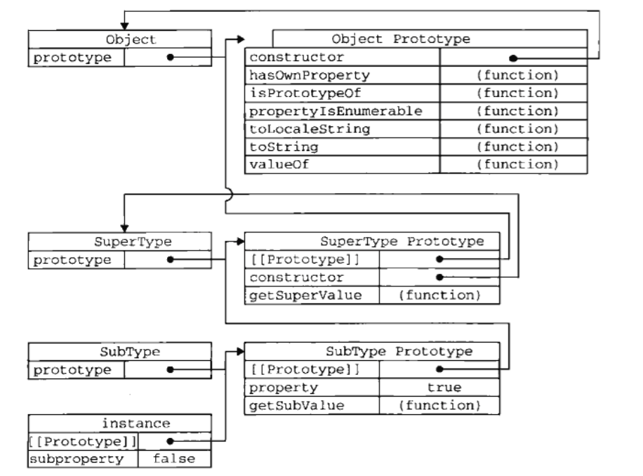

# 对象Object（一）- 继承 Inherit
### 原型链
- 原型概念：构造函数都有一个原型对象，原型对象包含一个指向构造函数的指针，实例包含一个指向原型对象的指针。
- 继承原理（原型链）：假设有A，B两个类型，把A的一个实例a作为B原型对象，则B的实例b则包含一个指向a的指针，a又包含一个指向A的原型对象的指针，从而形成原型链。
- 所有引用类型默认继承了Object。

````javascript
function SuperType() {
  this.property = true;
}

SuperType.prototype.getSuperValue = function() {
  return this.property;
}

function SubType() {
  this.subProperty = false;
}

SubType.prototype = new SuperType();  // inherit SuperType

SubType.prototype.getSubValue = function() {
  return this.subProperty;
}

var instance = new SubType();
console.log(instance.getSubValue());    // => false
console.log(instance.getSuperValue());  // => true
console.log(instance.constructor);      // => [Function: SuperType] // 因为原型被重新成SuperType的实例

console.log(instance instanceof Object);    // => true
console.log(instance instanceof SuperType); // => true
console.log(instance instanceof SubType);   // => true


console.log(Object.prototype.isPrototypeOf(instance));    // => true
console.log(SuperType.prototype.isPrototypeOf(instance)); // => true
console.log(SubType.prototype.isPrototypeOf(instance));   // => true
````

- 对应继承关系如下图
<div style="text-align:center;"></div>

- 原型链的问题：引用类型被所有实例共享；给超类传递参数会影响所有实例。

````javascript
function SuperType() {
  this.colors = ['red', 'blue', 'green'];
}

function SubType() {}

SubType.prototype = new SuperType();

var instance1 = new SubType();
instance1.colors.push('black');
console.log(instance1.colors);  // => [ 'red', 'blue', 'green', 'black' ]

var instance2 = new SubType();
console.log(instance2.colors);  // => [ 'red', 'blue', 'green', 'black' ]
````

- 借助构造函数：通过apply或call调研父类的构造函数（可在每个实例的作用域中调用）。优势是可以向父类传参，缺点则是定义的函数不能复用。

````javascript
// 借助构造函数
function SuperType() {
  this.colors = ['red', 'blue', 'green'];
}

function SubType() {
  // inherit SuperType
  SuperType.call(this);
}

var instance1 = new SubType();
instance1.colors.push('black');
console.log(instance1.colors);    // => [ 'red', 'blue', 'green', 'black' ]

var instance2 = new SubType();
console.log(instance2.colors);    // => [ 'red', 'blue', 'green' ]


// 传参
function SuperType(name) {
  this.name = name;
}

function SubType() {
  SuperType.call(this, 'Nicholas');

  this.age = 29;
}

var instance1 = new SubType();
console.log(instance1.name);    // => Nicholas
console.log(instance1.age);     // => 29
````

- 组合继承

````javascript
// 组合继承
function SuperType(name) {
  this.name = name;
  this.colors = ['red', 'blue', 'green'];
}

SuperType.prototype.sayName = function() {
  console.log(this.name);
};

function SubType(name, age) {
  // inherit properties
  SuperType.call(this, name);

  this.age = age;
}

// inherit methods
SubType.prototype = new SuperType();

SubType.prototype.sayAge = function() {
  console.log(this.age);
}

var instance1 = new SubType('Nicholas', 29);
instance1.colors.push('black');
console.log(instance1.colors);  // => [ 'red', 'blue', 'green', 'black' ]
instance1.sayName();            // => Nicholas
instance1.sayAge();             // => 29

var instance2 = new SubType('Greg', 27);
console.log(instance2.colors);  // => [ 'red', 'blue', 'green' ]
instance2.sayName();            // => Greg
instance2.sayAge();             // => 27
````

- 寄生组合式继承

````javascript
// 寄生组合式继承
function inheritPrototype(subType, superType) {
  var prototype = Object(superType.prototype);
  prototype.constructor = subType;
  subType.prototype = prototype;
}

function SuperType(name) {
  this.name = name;
  this.colors = ['red', 'blue', 'green'];
}

SuperType.prototype.sayName = function() {
  console.log(this.name);
}

function SubType(name, age) {
  SuperType.call(this, name);

  this.age = age;
}

inheritPrototype(SubType, SuperType);

SubType.prototype.sayAge = function() {
  console.log(this.age);
};


var instance1 = new SubType('Nicholas', 29);
instance1.colors.push('black');
console.log(instance1.colors);  // => [ 'red', 'blue', 'green', 'black' ]
instance1.sayName();            // => Nicholas
instance1.sayAge();             // => 29

var instance2 = new SubType('Greg', 27);
console.log(instance2.colors);  // => [ 'red', 'blue', 'green' ]
instance2.sayName();            // => Greg
instance2.sayAge();             // => 27
````
